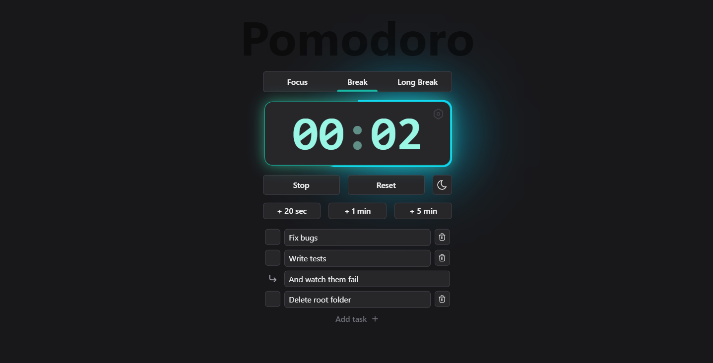
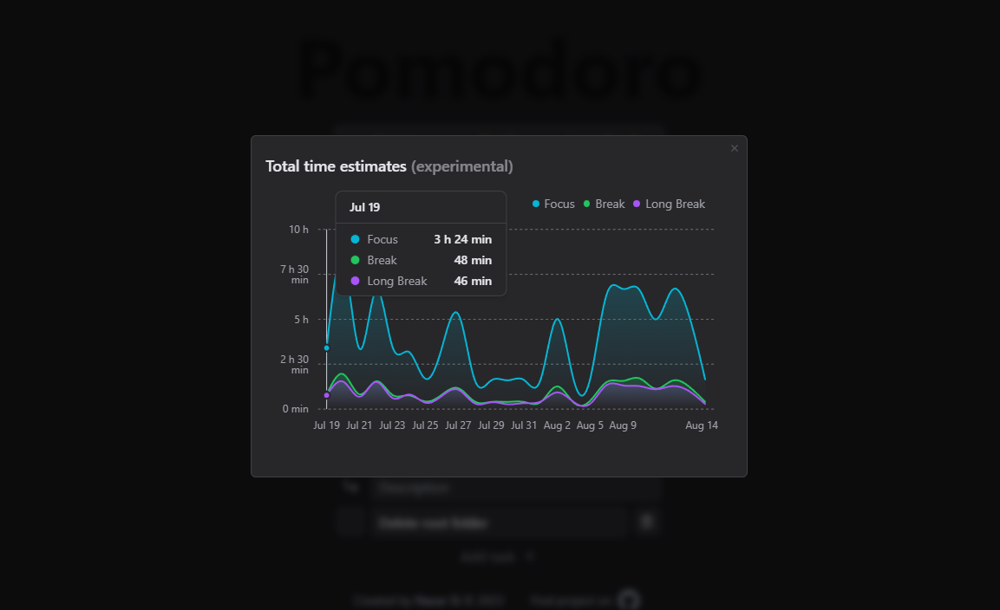

# [React Pomodoro Timer](https://timer.nazarsi.com)
The Pomodoro Timer is a simple yet powerful tool designed to enhance productivity and create a more focused work environment. Inspired by the Pomodoro Technique, this timer helps you break down your work into manageable intervals, allowing you to work with laser-like focus and take regular breaks to recharge.




## Key Features
- **Flexible Timer**: The timer is set to a default work session of 25 minutes followed by a 5-minute break. After completing 4 work sessions, the break is extended to 15 minutes. 
- **Task List**: Stay organized and track your tasks with the built-in task list feature. Add, edit, and prioritize your tasks, ensuring that you stay on top of your work and maximize your productivity.
- **Dark and Light Theme**: Customize the appearance of the timer with a choice of dark and light themes.
- **Progressive Web App (PWA)**: Experience enhanced accessibility and speed with our PWA feature. This allows you to install the Pomodoro Timer as a standalone app on your device, enabling offline access and improving load times. Leveraging service workers, the app caches essential resources, ensuring you have continued productivity even in unstable network conditions. With the PWA version, you're always just one click away from an optimized focus session.
- **Statistics Charts (*Experimental*)**: Gain valuable insights into your work habits and productivity with detailed statistics charts. Visualize your work sessions, breaks, and task completion rates, empowering you to analyze your performance and make informed adjustments.
- **Sound Effects (*Coming Soon*)**: Immerse yourself in a focused work environment with optional sound effects. Choose from a selection of soothing sounds to help you stay in the zone and maintain your concentration.
- **Notification System (*Coming Soon*)**: Never miss a work session or break with the Pomodoro Timer's notification system. Receive timely reminders and alerts, ensuring that you stay on track and maintain a consistent work rhythm.
- **Task Groups (*Coming Soon*)**: Organize your tasks into groups or categories, allowing you to focus on specific projects or areas of work. Easily switch between task groups, streamlining your workflow and increasing efficiency.
- **Save Settings Presets Locally (*Coming Soon*)**: Save your preferred timer settings as presets, making it effortless to switch between different work routines or share your preferred configurations with others.

## Technologies Used
The Pomodoro Timer project is built using the following technologies:

- **React**: A popular JavaScript library for building user interfaces, providing a robust and efficient foundation for the timer's frontend.
- **Zustand**: A state management library for React, enabling seamless data flow and efficient state updates within the timer application.
- **Vite**: A fast and lightweight build tool for modern web applications, ensuring quick development and optimized performance.
- **Yarn**: A package manager that allows for efficient dependency management and ensures consistent and reliable installations.
- **Tailwind CSS**: A utility-first CSS framework that provides a comprehensive set of pre-built styles and components, enabling rapid and responsive UI development.

## Run locally
To run this project locally, install libraries using `yarn`:
```
yarn
```
Then run it with:
```
yarn dev
```
You can also run linting and testing with:
```
yarn lint
yarn test
```

Or with `npm` if you prefer.

## License
The Pomodoro Timer is open-source software licensed under the [MIT License](./LICENSE). Feel free to use, modify, and distribute the timer according to the terms of the license.

## Contact
For any questions, feedback, or support requests, please contact me at [technotche@gmail.com](technotche@gmail.com) or leave an issue in this repository.

## Next comming features:
- Support adding description for the tasks
- Settings menu and custom time

## Known Issues
- Some components styles need to be cleaned up
- Test coverage is low and more test are needed
